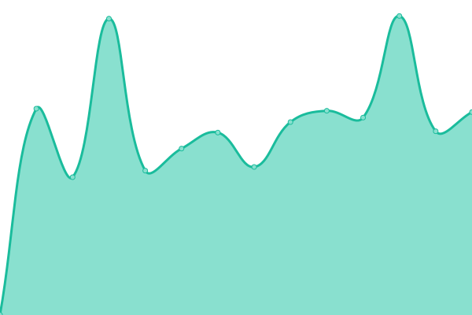

# [📈 Live Status](https://status.routechoices.com): <!--live status--> **🟩 All systems operational**

This repository contains the open-source uptime monitor and status page for [Routechoices.com](https://www.routechoices.com), powered by [Upptime](https://github.com/upptime/upptime).

With [Upptime](https://upptime.js.org), you can get your own unlimited and free uptime monitor and status page, powered entirely by a GitHub repository. We use [Issues](https://github.com/routechoices/upptime/issues) as incident reports, [Actions](https://github.com/routechoices/upptime/actions) as uptime monitors, and [Pages](https://status.routechoices.com) for the status page.

<!--start: status pages-->
<!-- This summary is generated by Upptime (https://github.com/upptime/upptime) -->
<!-- Do not edit this manually, your changes will be overwritten -->
<!-- prettier-ignore -->
| URL | Status | History | Response Time | Uptime |
| --- | ------ | ------- | ------------- | ------ |
|  [Routechoices](https://www.routechoices.com) | 🟩 Up | [routechoices.yml](https://github.com/routechoices/upptime/commits/HEAD/history/routechoices.yml) | 

 855ms
     
 | 

<a href="https://status.routechoices.com/history/routechoices">100.00%</a>
    

|  [API](https://api.routechoices.com/time?format=json) | 🟩 Up | [api.yml](https://github.com/routechoices/upptime/commits/HEAD/history/api.yml) | 

 686ms
     
 | 

<a href="https://status.routechoices.com/history/api">100.00%</a>
    

|  [App Location Posting Gateway](https://api.routechoices.com/locations) | 🟩 Up | [app-location-posting-gateway.yml](https://github.com/routechoices/upptime/commits/HEAD/history/app-location-posting-gateway.yml) | 

 158ms
     
 | 

<a href="https://status.routechoices.com/history/app-location-posting-gateway">81.48%</a>
    

|  [WMS Tile Server](https://wms.routechoices.com/?service=WMS&request=GetMap&layers=fhDbzlQSLho&styles=&format=image%2Fjpeg&transparent=false&version=1.1.1&width=512&height=512&srs=EPSG%3A3857&bbox=2641663.6975356913,8727274.141488286,2661231.576776697,8746842.020729292) | 🟩 Up | [wms-tile-server.yml](https://github.com/routechoices/upptime/commits/HEAD/history/wms-tile-server.yml) | 

 859ms
     
 | 

<a href="https://status.routechoices.com/history/wms-tile-server">100.00%</a>
    

|  [TCP Server](routechoices.com) | 🟩 Up | [tcp-server.yml](https://github.com/routechoices/upptime/commits/HEAD/history/tcp-server.yml) | 

 146ms
     
 | 

<a href="https://status.routechoices.com/history/tcp-server">100.00%</a>
    

<!--end: status pages-->

[**Visit our status website →**](https://status.routechoices.com)

## 📄 License

- Powered by: [Upptime](https://github.com/upptime/upptime)
- Code: [MIT](./LICENSE) © [Anand Chowdhary](https://anandchowdhary.com), supported by [Pabio](https://pabio.com)
- Data in the `./history` directory: [Open Database License](https://opendatacommons.org/licenses/odbl/1-0/)
